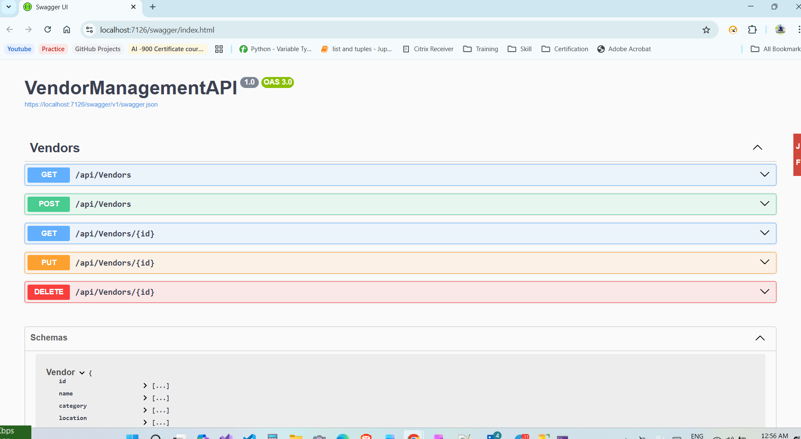
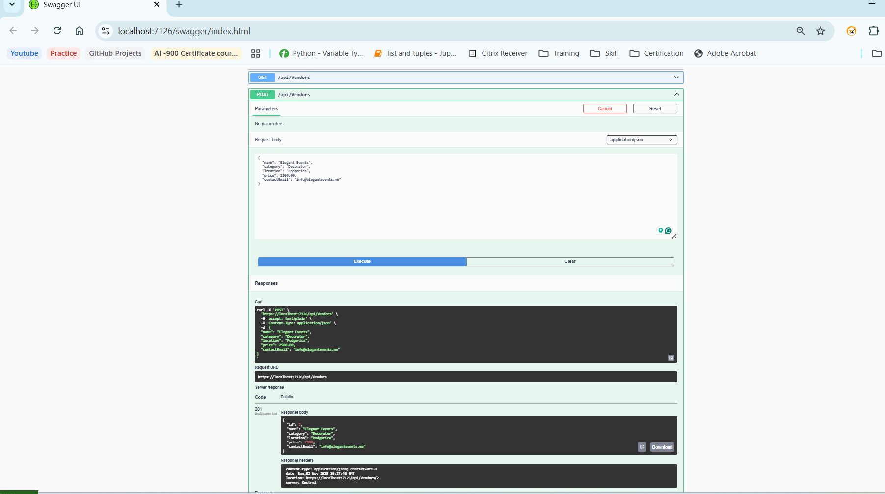

### 🕊️ Vendor Management API

A simple and scalable **ASP.NET Core Web API** built to manage vendors, categories, and bookings for wedding and event platforms.
It allows users to **create, update, delete, and view vendors**, making it a great base for marketplaces like *WeddingWire* or *The Knot*.

---

## 🚀 Features

* RESTful CRUD operations for Vendors
* Built with **ASP.NET Core 7.0** and **Entity Framework Core**
* Integrated **Swagger UI** for easy testing
* Local SQL Server (LocalDB) connection
* Clean and modular architecture
* Ready for deployment to Azure / IIS

---

## 🧠 Tech Stack

| Layer    | Technology            |
| -------- | --------------------- |
| Backend  | ASP.NET Core Web API  |
| Database | SQL Server (LocalDB)  |
| ORM      | Entity Framework Core |
| Testing  | Swagger UI            |
| Language | C#                    |

---

## ⚙️ Setup Instructions

### 1️⃣ Clone the repository

```bash
git clone https://github.com/<your-username>/VendorManagementAPI.git
cd VendorManagementAPI
```

### 2️⃣ Update the connection string

Edit **`appsettings.json`**:

```json
"ConnectionStrings": {
  "DefaultConnection": "Server=(localdb)\\MSSQLLocalDB;Database=VendorDB;Trusted_Connection=True;"
}
```

### 3️⃣ Run database migrations

In Visual Studio:

```
Add-Migration InitialCreate
Update-Database
```

### 4️⃣ Run the project

Press **F5** or **Ctrl + F5** to start the API.
Swagger will open automatically at:

```
https://localhost:7134/swagger/index.html
```

---

## 🧩 API Endpoints

| Method | Endpoint            | Description            |
| ------ | ------------------- | ---------------------- |
| GET    | `/api/vendors`      | Get all vendors        |
| GET    | `/api/vendors/{id}` | Get a vendor by ID     |
| POST   | `/api/vendors`      | Add a new vendor       |
| PUT    | `/api/vendors/{id}` | Update existing vendor |
| DELETE | `/api/vendors/{id}` | Delete vendor          |

---

## 📬 Sample API Request & Response

### ➕ **POST /api/vendors**

**Request Body:**

```json
{
  "name": "Elegant Events",
  "category": "Decorator",
  "location": "Podgorica",
  "price": 2500.00,
  "contactEmail": "info@elegantevents.me"
}
```

**Response (201 Created):**

```json
{
  "id": 1,
  "name": "Elegant Events",
  "category": "Decorator",
  "location": "Podgorica",
  "price": 2500.0,
  "contactEmail": "info@elegantevents.me"
}
```

### 📸 Screenshots:

```markdown

| API Overview | API Response |
|---------------|--------------|
|  |  |
```

---

## 🔮 Future Enhancements

* Add authentication (JWT / Identity)
* Add Booking & Payment modules
* Integrate front-end (React / Angular)
* Host API on Azure App Service

---

## 👨‍💻 Author

**Saket Malviya**
.NET Full Stack Developer
[GitHub](https://github.com/Saket-malviya) | [LinkedIn](https://linkedin.com/in/<your-profile>)

---

## ✅ License

This project is licensed under the MIT License — feel free to use and modify.

---

## 📈 Example Git Commit Message

When pushing to GitHub:

```
Initial commit - Created Vendor Management API with CRUD operations and Swagger documentation
```

---
